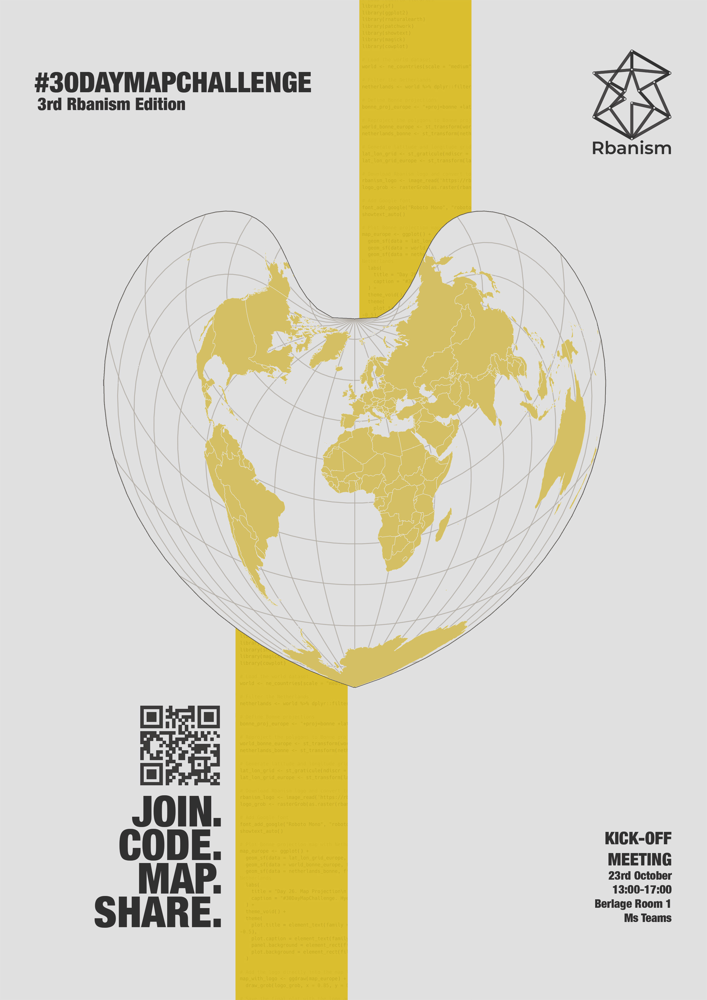

```{=html}
<div class="pf-hero">
  <a href="https://rbanism.org" target="_blank" rel="noopener">
    
  </a>
</div>
```

::: {.pf-section}

```{=html}
<!-- TODO: replace href with the MS Form link -->
<div class="pf-cta pf-cta-top">
  <p class="pf-cta-text">Join the third Rbanism edition of the #30DayMapChallenge this November.</p>
  <a class="pf-cta-button" href="https://forms.cloud.microsoft/e/npqvuyz1Yq?origin=lprLink" target="_blank" rel="noopener">Register now</a>
</div>
```

## The #30DayMapChallenge

This November, join the **[Rbanism community](https://rbanism.org/)** for the third edition of the #30DayMapChallenge!  

The **[#30DayMapChallenge](https://30daymapchallenge.com/)** was started in 2019 by Topi Tjukanov, a Finnish cartographer. It's a daily cartography and data visualization challenge aimed at the spatial community, where every day throughout November a different theme is set and participants create a map or visualization based on that theme and share it on social media using the hashtag. 

The Rbanism twist: maps made entirely in R, published on our repo on GitHub (see the 2024 edition [here](https://github.com/Rbanism/30DayMapChallenge2024/) and the 2025 one [here](https://github.com/Rbanism/30DayMapChallenge2025/)), alongside the code. We share the topics and work on the maps together. 

It's a fun, low-pressure way to sharpen your spatial data, cartography, and coding skills, no matter your experience level.

## Why join?

::: {.pf-cards}

::: {.pf-card}
#### Build your portfolio
One or two polished maps, made from real data and your own code, that you can show off on GitHub, LinkedIn, or in your next job/PhD application.
:::

::: {.pf-card}
#### Join the community
See how map lovers tackle the same themes in totally different ways, and pick up tricks you'd never find in a tutorial.
:::

::: {.pf-card}
#### Practice on real problems
Work with actual spatial datasets, the same kind you'll use in thesis work or future urban/climate projects.
:::

::: {.pf-card}
#### Level up your R skills
{sf}, {ggplot2}, {tmap}, and whatever else you want to try &mdash; one focused project, zero pressure to be an expert.
:::

::: {.pf-card}
#### You're not doing it alone
We kick off together, share the topics and learning materials, and celebrate everyone's maps on Rbanism's socials.
:::

::: {.pf-card}
#### Code like a pro
Build habits &mdash; clean, documented, shareable code &mdash; that make your work reproducible and easy for others to build on.
:::

::: {.pf-card}
#### Low commitment, real payoff
Pick a day or two that speaks to you and make something you're proud of. No need to do all 30.
:::

:::

## How it works

- We meet on the 23rd of October to kick off the challenge (Faculty of Architecture, TU Delft, Berlagezaal 1,  and MsTeams) 
- We share the topics, learning materials and examples 
- We upload the maps and the code on the day of the actual topic (or before!)
- We share the maps on our social media (Instagram and Bluesky) with the hashtag #30DayMapChallenge. You can do it on yours too, and tag it so the Rbanism community can - find and celebrate your work 
- When: Throughout November 

Questions or want to team up? Contact rbanism@tudelft.nl 

## Challenge Kick-Off program (tentative)
Berlagezaal 1 / Ms Teams (link will follow)

| Time | Activity |
|---|---|
|13:00 | lunch 
|13:30 | lecture Mark Pedgham
|14:30 | kick off #30DayMapChallenge
|15:30 | break
|16:00 | Urbex book club

```{=html}
<!-- TODO: replace href with the MS Form link -->
<div class="pf-cta">
  <p class="pf-cta-text">Ready to map with us? Register for the challenge and the kick-off.</p>
  <a class="pf-cta-button" href="https://forms.cloud.microsoft/e/npqvuyz1Yq?origin=lprLink" target="_blank" rel="noopener">Register now</a>
</div>
```

:::

::: {.pf-section}
## Daily themes

Every day of November has its own theme, set by the [#30DayMapChallenge](https://30daymapchallenge.com/#2026-themes). Pick the ones that speak to you!

```{=html}
<div class="pf-cal" role="list" aria-label="#30DayMapChallenge 2026 daily themes, November 2026">
  <div class="pf-cal-weekday" aria-hidden="true">Mon</div>
  <div class="pf-cal-weekday" aria-hidden="true">Tue</div>
  <div class="pf-cal-weekday" aria-hidden="true">Wed</div>
  <div class="pf-cal-weekday" aria-hidden="true">Thu</div>
  <div class="pf-cal-weekday" aria-hidden="true">Fri</div>
  <div class="pf-cal-weekday" aria-hidden="true">Sat</div>
  <div class="pf-cal-weekday" aria-hidden="true">Sun</div>
  <div class="pf-cal-intro" aria-hidden="true"><span class="pf-cal-month">November 2026</span></div>
  <div class="pf-cal-day is-weekend" role="listitem">
    <div class="pf-cal-head"><span class="pf-cal-num">1</span><span class="pf-cal-wd">Sun</span></div>
    <p class="pf-cal-theme">Points</p>
    <p class="pf-cal-desc">A map challenge classic. Map with points.</p>
  </div>
  <div class="pf-cal-day" role="listitem">
    <div class="pf-cal-head"><span class="pf-cal-num">2</span><span class="pf-cal-wd">Mon</span></div>
    <p class="pf-cal-theme">Lines</p>
    <p class="pf-cal-desc">A map challenge classic. Map with lines.</p>
  </div>
  <div class="pf-cal-day" role="listitem">
    <div class="pf-cal-head"><span class="pf-cal-num">3</span><span class="pf-cal-wd">Tue</span></div>
    <p class="pf-cal-theme">Polygons</p>
    <p class="pf-cal-desc">A map challenge classic. Map with polygons.</p>
  </div>
  <div class="pf-cal-day" role="listitem">
    <div class="pf-cal-head"><span class="pf-cal-num">4</span><span class="pf-cal-wd">Wed</span></div>
    <p class="pf-cal-theme">Clusters</p>
    <p class="pf-cal-desc">Clusters of something. Hotspots, groups, things that gather together.</p>
  </div>
  <div class="pf-cal-day" role="listitem">
    <div class="pf-cal-head"><span class="pf-cal-num">5</span><span class="pf-cal-wd">Thu</span></div>
    <p class="pf-cal-theme">Senses: Sight</p>
    <p class="pf-cal-desc">How do you see something? Maybe map a viewshed?</p>
  </div>
  <div class="pf-cal-day" role="listitem">
    <div class="pf-cal-head"><span class="pf-cal-num">6</span><span class="pf-cal-wd">Fri</span></div>
    <p class="pf-cal-theme">Vintage</p>
    <p class="pf-cal-desc">Spin up your time machine and do a map which looks like a historical map.</p>
  </div>
  <div class="pf-cal-day is-weekend" role="listitem">
    <div class="pf-cal-head"><span class="pf-cal-num">7</span><span class="pf-cal-wd">Sat</span></div>
    <p class="pf-cal-theme">10 minute map</p>
    <p class="pf-cal-desc">You have no more than 10 minutes to complete this map.</p>
  </div>
  <div class="pf-cal-day is-weekend" role="listitem">
    <div class="pf-cal-head"><span class="pf-cal-num">8</span><span class="pf-cal-wd">Sun</span></div>
    <p class="pf-cal-theme">Utopia</p>
    <p class="pf-cal-desc">A map of something which could be.</p>
  </div>
  <div class="pf-cal-day" role="listitem">
    <div class="pf-cal-head"><span class="pf-cal-num">9</span><span class="pf-cal-wd">Mon</span></div>
    <p class="pf-cal-theme">Urban-rural</p>
    <p class="pf-cal-desc">Urban or rural. Cities and countryside.</p>
  </div>
  <div class="pf-cal-day" role="listitem">
    <div class="pf-cal-head"><span class="pf-cal-num">10</span><span class="pf-cal-wd">Tue</span></div>
    <p class="pf-cal-theme">Prompting only</p>
    <p class="pf-cal-desc">Make AI work for its money and produce something from start to finish.</p>
  </div>
  <div class="pf-cal-day" role="listitem">
    <div class="pf-cal-head"><span class="pf-cal-num">11</span><span class="pf-cal-wd">Wed</span></div>
    <p class="pf-cal-theme">Senses: Sound</p>
    <p class="pf-cal-desc">How do you hear something? How do you map a soundscape?</p>
  </div>
  <div class="pf-cal-day" role="listitem">
    <div class="pf-cal-head"><span class="pf-cal-num">12</span><span class="pf-cal-wd">Thu</span></div>
    <p class="pf-cal-theme">Power</p>
    <p class="pf-cal-desc">Power as in nuclear power? Or physical power or influence?</p>
  </div>
  <div class="pf-cal-day" role="listitem">
    <div class="pf-cal-head"><span class="pf-cal-num">13</span><span class="pf-cal-wd">Fri</span></div>
    <p class="pf-cal-theme">Interactions</p>
    <p class="pf-cal-desc">Interactions between things, or maybe the result would be an interactive map.</p>
  </div>
  <div class="pf-cal-day is-weekend" role="listitem">
    <div class="pf-cal-head"><span class="pf-cal-num">14</span><span class="pf-cal-wd">Sat</span></div>
    <p class="pf-cal-theme">Borgesian map</p>
    <p class="pf-cal-desc">A map so detailed it becomes the territory.</p>
  </div>
  <div class="pf-cal-day is-weekend" role="listitem">
    <div class="pf-cal-head"><span class="pf-cal-num">15</span><span class="pf-cal-wd">Sun</span></div>
    <p class="pf-cal-theme">Inside out</p>
    <p class="pf-cal-desc">Inside out, upside down. Something on this map is not quite right.</p>
  </div>
  <div class="pf-cal-day" role="listitem">
    <div class="pf-cal-head"><span class="pf-cal-num">16</span><span class="pf-cal-wd">Mon</span></div>
    <p class="pf-cal-theme">Collaborative map</p>
    <p class="pf-cal-desc">Do a map with a friend, colleague or a stranger.</p>
  </div>
  <div class="pf-cal-day" role="listitem">
    <div class="pf-cal-head"><span class="pf-cal-num">17</span><span class="pf-cal-wd">Tue</span></div>
    <p class="pf-cal-theme">Light &amp; dark</p>
    <p class="pf-cal-desc">Play with visual effects. What can you map with just light and shadows?</p>
  </div>
  <div class="pf-cal-day" role="listitem">
    <div class="pf-cal-head"><span class="pf-cal-num">18</span><span class="pf-cal-wd">Wed</span></div>
    <p class="pf-cal-theme">NULL</p>
  </div>
  <div class="pf-cal-day" role="listitem">
    <div class="pf-cal-head"><span class="pf-cal-num">19</span><span class="pf-cal-wd">Thu</span></div>
    <p class="pf-cal-theme">Senses: Smell</p>
    <p class="pf-cal-desc">How do you map things which your nose can sense?</p>
  </div>
  <div class="pf-cal-day" role="listitem">
    <div class="pf-cal-head"><span class="pf-cal-num">20</span><span class="pf-cal-wd">Fri</span></div>
    <p class="pf-cal-theme">Hexagons</p>
    <p class="pf-cal-desc">Hexagons, the good old bestagons.</p>
  </div>
  <div class="pf-cal-day is-weekend" role="listitem">
    <div class="pf-cal-head"><span class="pf-cal-num">21</span><span class="pf-cal-wd">Sat</span></div>
    <p class="pf-cal-theme">OpenStreetMap</p>
    <p class="pf-cal-desc">The awesome data source for mapping. You can also use this day to edit OSM.</p>
  </div>
  <div class="pf-cal-day is-weekend" role="listitem">
    <div class="pf-cal-head"><span class="pf-cal-num">22</span><span class="pf-cal-wd">Sun</span></div>
    <p class="pf-cal-theme">Projections</p>
    <p class="pf-cal-desc">The different ways of representing a globe on a flat surface.</p>
  </div>
  <div class="pf-cal-day" role="listitem">
    <div class="pf-cal-head"><span class="pf-cal-num">23</span><span class="pf-cal-wd">Mon</span></div>
    <p class="pf-cal-theme">Senses: Taste</p>
    <p class="pf-cal-desc">Food, drink or something else which you can taste.</p>
  </div>
  <div class="pf-cal-day" role="listitem">
    <div class="pf-cal-head"><span class="pf-cal-num">24</span><span class="pf-cal-wd">Tue</span></div>
    <p class="pf-cal-theme">Network</p>
    <p class="pf-cal-desc">Route network, transit network, human network or something completely different.</p>
  </div>
  <div class="pf-cal-day" role="listitem">
    <div class="pf-cal-head"><span class="pf-cal-num">25</span><span class="pf-cal-wd">Wed</span></div>
    <p class="pf-cal-theme">Is this a map?</p>
    <p class="pf-cal-desc">Stretch the limits of maps and blend your map with an artwork.</p>
  </div>
  <div class="pf-cal-day" role="listitem">
    <div class="pf-cal-head"><span class="pf-cal-num">26</span><span class="pf-cal-wd">Thu</span></div>
    <p class="pf-cal-theme">Water</p>
    <p class="pf-cal-desc">About 71% of the Earth&#x27;s surface. That wet thing, you know?</p>
  </div>
  <div class="pf-cal-day" role="listitem">
    <div class="pf-cal-head"><span class="pf-cal-num">27</span><span class="pf-cal-wd">Fri</span></div>
    <p class="pf-cal-theme">New tool</p>
    <p class="pf-cal-desc">Try out a new tool in your mapmaking workflow.</p>
  </div>
  <div class="pf-cal-day is-weekend" role="listitem">
    <div class="pf-cal-head"><span class="pf-cal-num">28</span><span class="pf-cal-wd">Sat</span></div>
    <p class="pf-cal-theme">Senses: Feeling</p>
    <p class="pf-cal-desc">The most abstract of the senses series. How would you map a feeling?</p>
  </div>
  <div class="pf-cal-day is-weekend" role="listitem">
    <div class="pf-cal-head"><span class="pf-cal-num">29</span><span class="pf-cal-wd">Sun</span></div>
    <p class="pf-cal-theme">Raster</p>
    <p class="pf-cal-desc">Do something cool with pixels.</p>
  </div>
  <div class="pf-cal-day" role="listitem">
    <div class="pf-cal-head"><span class="pf-cal-num">30</span><span class="pf-cal-wd">Mon</span></div>
    <p class="pf-cal-theme">Pen &amp; paper</p>
    <p class="pf-cal-desc">Time to wrap up the challenge by closing your laptop for a while.</p>
  </div>
</div>
```
:::

```{=html}
<div class="pf-footer">
  <p>Join. Code. Map. Share. &mdash; <a href="https://rbanism.org" target="_blank" rel="noopener">rbanism.org</a></p>
</div>
```
